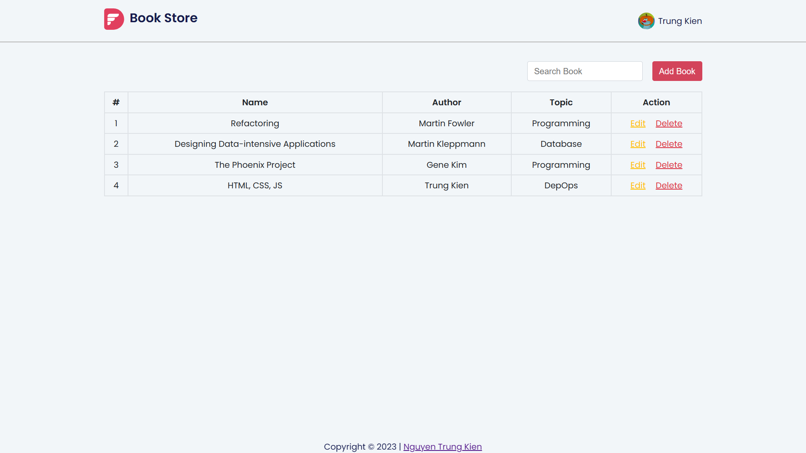

# HTML, CSS & JavaScript

## functional way

1. **List Book:** List of books corresponding to the topic.
2. **Search By Book:** Search for books based on book title.
3. **Add, Edit and Delete Book:** Add, edit and delete books.

